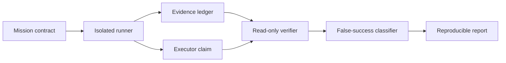

# Hermes Autopilot Reliability Lab

[](https://github.com/piemasterflex111/hermes-autopilot-reliability-lab/actions/workflows/ci.yml)
[](https://www.python.org/)
[](LICENSE)

A reproducible engineering laboratory for measuring whether autonomous coding agents
actually completed repository missions correctly—not whether they produced a confident
success summary.

## Why this exists

Autonomous coding systems can fail while reporting success. Verification may be stale,
tests may be modified to pass, recovery checkpoints may contradict each other, or the
executor may grade its own work. This project turns those risks into explicit benchmark
cases, machine-readable evidence, and reproducible engineering experiments.

## Current milestone: engineering operating system

Milestone 0 establishes the rules and tooling required before benchmark execution begins:

- Python 3.12 package with strict typing and immutable benchmark identity models;
- one-command verification through `make verify`;
- deterministic tests with a 90% coverage gate;
- Ruff, mypy, pytest, build verification, and GitHub Actions;
- issue, pull-request, security, architecture, ADR, runbook, and incident templates;
- explicit Definition of Ready and Definition of Done;
- real incident records from early Hermes Project Autopilot failures.

## Architecture direction



Only the typed identity layer and engineering foundation exist in Milestone 0. The runner,
evidence ingestion, verifier adapters, classifier, and reports are planned work.

## Quick start

```bash
git clone https://github.com/piemasterflex111/hermes-autopilot-reliability-lab.git
cd hermes-autopilot-reliability-lab
make verify
```

`make verify` synchronizes the locked environment, checks formatting and lint rules, runs
strict typing, executes the test suite with coverage, and builds the package.

## Engineering rules

1. No implementation begins without an observable outcome and verification commands.
2. No direct work occurs on `main`; changes use issue → branch → pull request → CI → review.
3. Every defect receives a reproducer and regression test.
4. Architectural choices receive an ADR.
5. Completion is gated by recorded evidence, not executor prose.
6. One implementation mission is active at a time.
7. Every milestone produces a tagged release and reproducible report.

See [Engineering Process](docs/engineering-process.md),
[Definition of Ready](docs/definition-of-ready.md), and
[Definition of Done](docs/definition-of-done.md).

## Explicit non-goals for Milestone 0

- invoking language models;
- executing autonomous repository missions;
- distributed workers or queues;
- network egress or destination allowlists;
- cloud deployment or production operations;
- claiming benchmark performance before a public corpus exists.

## Roadmap

- **M0:** engineering foundation and typed benchmark identity;
- **M1:** machine-readable benchmark contract and seeded fixtures;
- **M2:** deterministic worktree runner and evidence capture;
- **M3:** false-success classifier and independent verification;
- **M4:** checkpoint lineage, supersession, and restart recovery;
- **M5:** OpenTelemetry instrumentation and public benchmark report.

## Relationship to Hermes Project Autopilot

[Hermes Project Autopilot](https://github.com/piemasterflex111/hermes-project-autopilot)
is the autonomous mission subsystem being evaluated. This repository is deliberately
separate: it defines the benchmark cases, measurement rules, failure taxonomy, and public
evidence needed to evaluate Autopilot and future agent systems objectively.
